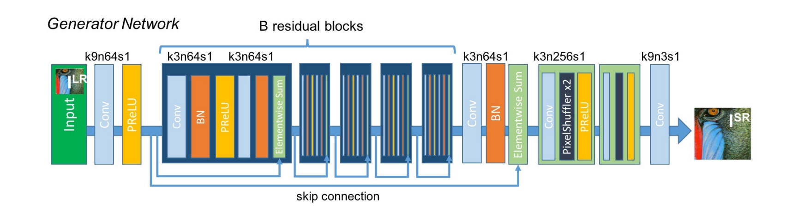

# DeepClarity 🔍


<p align="center">
    
</p>


**Final Solution Presentation: [PPT](https://docs.google.com/presentation/d/1owT0P4APnO378lmpZcQmLeYKn2GElC5S8DXPNUTS33Q/)**


**🚀 DeepClarity** introduces novel models designed from scratch to address the dual challenges of **detecting and enhancing pixelated images** with **exceptional speeds**. The proposed detection model, leveraging **MobileNet_v3_small combined with Canny edge detection**, demonstrates significant improvements over baseline methods on datasets like **Div2K** and **Flickr2K**. This model achieves higher precision, recall, F1 score, and accuracy while maintaining a lower false positive rate. Despite a slightly reduced speed compared to the baseline, the model remains efficient, operating at **3505 FPS**. ⚡

For image correction, the project introduces three new novel variants of SRGAN namely **MobileSR**, **MiniSRGAN** and **TinySRGAN**. These models showcase enhanced performance in terms of PSNR, SSIM, LPIPS metrics, and speed compared to traditional methods like Bicubic and other deep learning approaches (such as EDSR, FSRCNN and SRGAN). MobileSR, MiniSRGAN and TinySRGAN strike a balance between visual quality and computational efficiency, operating at **28 FPS**, **21 FPS** and **48 FPS!!!** respectively, with a compact model size of **0.482 MB**,**3.605 MB** and **0.780 MB**. 🖼️✨

Both models were implemented entirely from scratch and are hosted on HuggingFace for accessibility, although optimal performance is observed with GPU-based execution. 

<p align="center">
    
    </p>

## :bookmark_tabs: Table of Contents
- [Try It Yourself](#fire-try-it-yourself-fire)
- [Results](#results)
- [Model Architecture](#architecture)
- [Training and Testing Dataset Details](#training-and-testing-dataset-details)
- [Training Details](#training-details)
- [Requirements](#requirements)
- [Inference: Detection](#inference-detection)
- [Inference: Correction](#inference-correction)
- [Directory Structure](#directory-structure)
- [Future Work](#future-work)
- [Contributing](#contributing)


## :fire: Try it yourself!!!! :fire:

The models are hosted on HuggingFace :hugs:, but please note that their speed might not be optimal since they are running on CPUs (free tier).

**Detection Model:** [IntelAI Detection](https://huggingface.co/spaces/snehilchatterjee/intelAI_detection)

**Correction Model:** [IntelAI Correction](https://huggingface.co/spaces/snehilchatterjee/intelAIcorrect)

**Unified App:** [IntelAI App](https://huggingface.co/spaces/snehilchatterjee/deepclarity)


## :star: Results

**The performance of these models was tested on RTX 3060 Mobile GPU.**

###  <ins>Detection Results: </ins>

### MobileNet_v3_small + Canny Edge Detection

**Datasets used for testing:**

- Div2K (Full dataset - 900 images)
- Flickr2K (Test split - 284 images)

**Performance:**

The baseline model was not evaluated on the Div2K dataset due to its poor performance on the Flickr2K validation/test set.

### Comparison of Proposed Method vs Baseline


#### Metrics on Flickr2K's test set

| Metric           | Proposed Method on Flickr2K | Baseline on Flickr2K  |
|------------------|-----------------------------|-----------------------|
| **Precision**    | 0.944                       | 0.5648                |
| **Recall**       | 0.9007633                   | 0.4326                |
| **F1 Score**     | 0.921875                    | 0.4899                |
| **Accuracy**     | 0.9300595                   | 0.5556                |
| **False Positives** | 4.58%                    | 32.867%               |
| **Speed**        | 3505 FPS                    | 3522 FPS              |
| **Model Size**   | 5.844 MB                    | 5.844 MB              |

### Confusion Matrices:


<p float="left">
   <h3>Proposed Method:</h3>
  
  <h3>Baseline:</h3>
  
</p>


#### Metrics on Div2K

| Metric           | Proposed Method on Div2K |
|------------------|--------------------------|
| **Precision**    | 0.9084967                |
| **Recall**       | 0.9084967                |
| **F1 Score**     | 0.9084967                |
| **Accuracy**     | 0.9046053                |
| **False Positives** | 9.52%                 |
| **Speed**        | 3505 FPS                 |
| **Model Size**   | 5.844 MB                 |

### Confusion Matrix:


### Summary

The proposed method outperforms the baseline significantly across all evaluation metrics on the Flickr2K dataset. It achieves higher precision, recall, F1 score, and accuracy, while maintaining a much lower false positive rate. The model size remains consistent across both methods. 

Overall, the proposed method demonstrates superior performance and is a clear improvement over the baseline, especially in terms of accuracy and reliability.

###  <ins>Correction Results: </ins>

### Comparison of Image Super-Resolution Methods (Evaluated on Set5)


| Metric            | Bicubic (Baseline)      | MobileSR (Proposed)        | MiniSRGAN (Proposed)      | TinySRGAN (Proposed)      | MiniSRResNET              | SRGAN                    | EDSR                     | FSRCNN                   |
|-------------------|-------------------------|----------------------------|---------------------------|---------------------------|---------------------------|--------------------------|--------------------------|--------------------------|
| PSNR              | 27.76 dB                | 27.17 dB                   | 30.13 dB                  | 30.64 dB                  | 31.76 dB                  | 29.99 dB                 | 31.78 dB                 | 30.52 dB                 |
| SSIM              | 0.7806                  | 0.7650                     | 0.8340                    | 0.8576                    | 0.8829                    | 0.8176                   | 0.8895                   | 0.8548                   |
| LPIPS             | 0.3658                  | 0.2000                     | 0.1264                    | 0.1554                    | 0.1928                    | 0.1118                   | 0.1922                   | 0.2013                   |
| Speed (FPS)       | -                       | 28                         | 21                        | 48                        | 21                        | 12                       | 16                       | 188                      |
| Model Size (MB)   | -                       | 0.482                      | 3.605                     | 0.780                     | 3.605                     | 5.874                    | 5.789                    | 0.049                    |

**Sample Output:**


***1) Top Row: Input, Middle Row: Output, Bottom Row: Target (MobileSR)***


Close up (MobileSR):


***2) Set5***

<p align="center">
  <b>Original</b> | <b>MobileSR</b>  |<b>MiniSRGAN</b> | <b>TinySRGAN</b>
</p>
<p align="center">
  
  
  
  
</p>

<p align="center">
  
  
  
  
</p>

<p align="center">
  
  
  
  
</p>

<p align="center">
  
  
  
  
</p>

<p align="center">
  
  
  
  
</p>


## Architecture

### Detector Architecture:


### MobileSR Architecture:


### TinySRGAN Architecture:


### MiniSRGAN/MiniSRResNet Architecture:

Here B = 8 (for 8 residual blocks)




## Training and Testing Dataset Details

#### Detector Training
The detector was trained on the train split of the Flickr2K dataset, which consists of 2,200 images.

#### Detector Testing
The detector was tested in two phases:
1. Test split of the Flickr2K dataset, consisting of 284 images.
2. The full dataset of Div2K (train + val) to ensure the images were entirely independent of the trained dataset.


#### Super Resolution Model Training (MobileSR)
This super resolution model was trained on a subset of the [COCO dataset](https://cocodataset.org/), using a total of 21,837 images.

#### Super Resolution Model Validation (MobileSR)
The validation of this super resolution model was conducted using 166 randomly picked images from the Flickr2K dataset.

#### Super Resolution Model Training (MiniSRGAN)
This super resolution model was trained on a train set of the [Div2K dataset](https://data.vision.ee.ethz.ch/cvl/DIV2K/), using a total of 800 images.

#### Super Resolution Model Training (TinySRGAN)
This super resolution model was trained on a train set of the [Div2K dataset](https://data.vision.ee.ethz.ch/cvl/DIV2K/), using a total of 800 images.


#### Testing of Proposed SR Models:
The testing of the super resolution model was done on the [Set5](https://figshare.com/articles/dataset/BSD100_Set5_Set14_Urban100/21586188) dataset

## Training Details

### Detector:
**Problem**:

- The models when trained on the COCO dataset (subset with ~21k images) performed poorly with HD images.

**Solution:**

- The dataset used for training was enriched with images exceeding 1920x1080 resolution.

**Reasoning:**
- Resizing an image from a higher resolution (e.g., HD) to a smaller size (224x224) retains more information compared to resizing a lower resolution image to the same size.
- This additional information during training presumably helped the model generalize better to handle HD images during inference.
Additional Preprocessing:

The images undergo other standard preprocessing steps like Canny edge detection before being fed into the model.

### Generator:
No specialized training was conducted; models were trained using regular methods to generate images four times the size of the input. Preprocessing for MobileSR was performed dynamically during training. In contrast, preprocessing for TinySRGAN and MiniSRGAN was already completed, utilizing the Div2K dataset.

## Requirements

Install the necessary libraries:
```sh
pip install -r requirements.txt
```

## :stop_sign: IMPORTANT!!!!!!!

When running **locally**, ensure you use only the versions of libraries mentioned in `requirements.txt`. I've observed significant and incorrect differences in results when using different versions.

## Inference: Detection

To run the detection app, use the following command:
```sh
python detect_app.py
```

You will see the following output:


Open the provided link in any web browser to access the interface:


Select the method and proceed with uploading an image to detect if it is pixelated.

**Methods:**
- Method 1: MobileNetV3_Small
- Method 2 (Proposed method): MobileNetV3_Small + Canny Edge Detection

Example:


The result will appear as soon as you upload the image:


## Inference: Correction 

To run the correction app, use the following command:
```sh
python correct_app.py
```

You will see the following output:


Open the provided link in any web browser to access the interface:


Upload an image and click submit!

Example:


## Directory Structure

```
├── training_detection
│   ├── detection_method_1_Pixelated.ipynb    - Training notebook for detection method 1 (baseline)
│   └── detection_method_2_Pixelated.ipynb    - Training notebook for detection method 2 (proposed method)
│
├── training_correction
│   ├── training_mobilesr.ipynb               - Training notebook for correction method (MobileSR)
│   └── training_tinysrgan.ipynb              - Scripts for training correction models (TinySRGAN)
│
├── testing_correction
│   ├── Testing_Correction_Result.ipynb       - Notebook for obtaining images/sr_result.png and images/sr_closeup.png for MobileSR
│   ├── model_evaluation_set5.ipynb           - Notebook for evaluating all models on the Set5 dataset
│   ├── model_inference_set5.ipynb            - Notebook for performing inference on the Set5 dataset
│   ├── test_correct_sample2.ipynb            - Notebook for evaluating the sample2 image file
│   └── super_resolved_Set5_images_{model}    - Directory containing images obtained from inference
│
├── testing_detection
│   └── test_detect.ipynb                     - Test notebook for detection method 2 (proposed method)
│
├── time_calculation
│   └── time_calculation.ipynb                - Time measurement notebook for the detection and correction methods
│   └── time_calculation_tinysrgan.ipynb      - Time measurement notebook for TinySRGAN
|
├── model_size_calculation
│   └── model_size.ipynb                      - Model size measurement notebook for the detection and correction methods
│
├── experiment_detection  
│   ├── comparison_n                          - Directory containing comparisons between low_res and high_res images
│   └── solo_n                                - Directory containing low_res versions of sample images
│
├── images                                    - Directory containing readme.md images
│
├── image_analysis
│   └── pixel_detection_analysis.ipynb        - Notebook for degrading and storing sample images (experiment_detection folder)
│
├── sample2_correction_model_results          - Directory containing sample2 inference images for all models
│
├── weights                                   - Directory containing weights of the trained models
│
├── detect_app.py                             - Detection inference app.py file
│
└── correct_app.py                            - Correction inference app.py file
```

## Future Work

June 21, 2024 : <s> Obtaining Mean Opinion Score and calculating other metrics for super-resolution tasks. </s>

Making a pipeline which will detect and correct in the same app

## Contributing

Any kind of enhancement or contribution is welcomed.