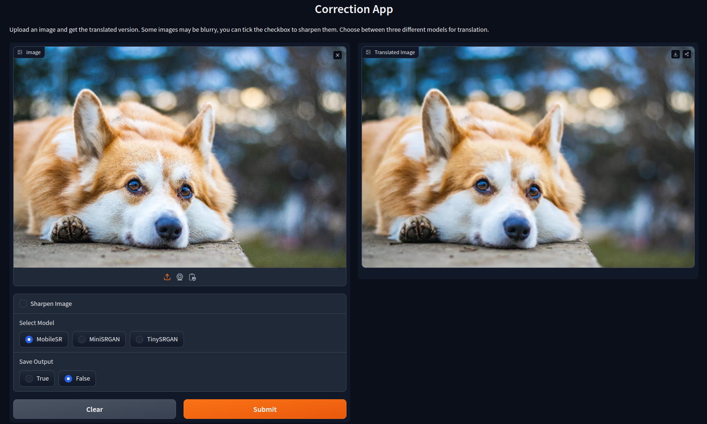

# DeepClarity

This project tackles the challenge of **detecting and enhancing** pixelated images at exceptional speeds.

## Table of Contents
- [Results](#results)
- [Requirements](#requirements)
- [Training and Testing Details](#training-and-testing-details)
- [Inference: Detection](#inference-detection)
- [Inference: Correction](#inference-correction)
- [In Detail](#in-detail)
- [Future Work](#future-work)
- [Contributing](#contributing)


## Results

**The performance of these models was tested on RTX 3060 Mobile GPU.**

###  <ins>Detection Results: </ins>

### MobileNet_v3_small + Canny Edge Detection

**Datasets used for testing:**

- Div2K (Full dataset - 900 images)
- Flickr2K (Test split - 284 images)

**Performance:**

The baseline model was not evaluated on the Div2K dataset due to its poor performance on the Flickr2K validation/test set.

**Proposed Method:**

Here's a comprehensive comparison between the proposed method and the baseline method, evaluated on the Div2K and Flickr2K datasets:

### Comparison of Proposed Method vs Baseline


#### Metrics on Flickr2K's test set

| Metric           | Proposed Method on Flickr2K | Baseline on Flickr2K  |
|------------------|-----------------------------|-----------------------|
| **Precision**    | 0.944                       | 0.5648                |
| **Recall**       | 0.9007633                   | 0.4326                |
| **F1 Score**     | 0.921875                    | 0.4899                |
| **Accuracy**     | 0.9300595                   | 0.5556                |
| **False Positives** | 4.58%                    | 32.867%               |
| **Speed**        | 3489 FPS                    | 3951 FPS              |
| **Model Size**   | 5.844 MB                    | 5.844 MB              |

#### Metrics on Div2K

| Metric           | Proposed Method on Div2K |
|------------------|--------------------------|
| **Precision**    | 0.9084967                |
| **Recall**       | 0.9084967                |
| **F1 Score**     | 0.9084967                |
| **Accuracy**     | 0.9046053                |
| **False Positives** | 9.52%                 |
| **Speed**        | 3489 FPS                 |
| **Model Size**   | 5.844 MB                 |

### Summary

The proposed method outperforms the baseline significantly across all evaluation metrics on the Flickr2K dataset. It achieves higher precision, recall, F1 score, and accuracy, while maintaining a much lower false positive rate. Although the proposed method has a slightly slower speed (3489 FPS vs. 3951 FPS), it is still extremely efficient and the trade-off is justified by the substantial improvements in other metrics. The model size remains consistent across both methods. 

Overall, the proposed method demonstrates superior performance and is a clear improvement over the baseline, especially in terms of accuracy and reliability.

###  <ins>Correction Results: </ins>

### Super Resolution with MobileSR

**Method:**

- SRGAN with a modified generator incorporating depthwise separable convolutions in residual blocks.
- Bilinear upsampling for improved performance in the final stage.

**Performance:**
Sure, here's the comparison in Markdown format:

### Comparison of Image Super-Resolution Methods (Evaluated on Sample2.jpeg)

| Metric        | Bicubic (Baseline)      | Proposed Method (MobileSR) | RealESRGAN               | FSRCNN                   | EDSR                     |
|---------------|-------------------------|----------------------------|--------------------------|--------------------------|--------------------------|
| PSNR          | 27.23 dB                | 28.95 dB                   | 27.21 dB                 | 29.09 dB                 | 29.19 dB                 |
| SSIM          | 0.6684                  | 0.7582                     | 0.7359                   | 0.7604                   | 0.7657                   |
| LPIPS         | 0.2878                  | 0.3794                     | 0.4633                   | 0.5985                   | 0.6461                   |
| Speed         | -                       | 28 FPS                     | -                        | -                        | -                        |
| Model Size    | -                       | 0.482 MB                   | -                        | -                        | -                        |


**Sample Output:**

***1) (480 x 320) -----> (1920 x 1280)***

<p float="left">
  
  
  
  
  
  
</p>

***2) Top Row: Input, Middle Row: Output, Bottom Row: Target***


Close up:


## Requirements

Install the necessary libraries:
```sh
pip install -r requirements.txt
```

## Training and Testing Details

#### Detector Training
The detector was trained on the train split of the Flickr2K dataset, which consists of 2,200 images.

#### Detector Testing
The detector was tested in two phases:
1. Test split of the Flickr2K dataset, consisting of 284 images.
2. The full dataset of Div2K (train + val) to ensure the images were entirely independent of the trained dataset.

#### Super Resolution Model Training
The super resolution model was trained on a subset of the [COCO dataset](https://cocodataset.org/), using a total of 21,837 images.

#### Super Resolution Model Testing
The testing of the super resolution model was conducted using 166 randomly picked images from the Flickr2K dataset.


## Inference: Detection

To run the detection app, use the following command:
```sh
python detect_app.py
```

You will see the following output:


Open the provided link in any web browser to access the interface:


Select the method and proceed with uploading an image to detect if it is pixelated.

**Methods:**
- Method 1: MobileNetV3_Small
- Method 2 (Proposed method): MobileNetV3_Small + Canny Edge Detection

Example:


The result will appear as soon as you upload the image:


## Inference: Correction 

To run the correction app, use the following command:
```sh
python correct_app.py
```

You will see the following output:


Open the provided link in any web browser to access the interface:


Upload an image and click submit!

Example:


## In Detail

```
├── detection_method 1 [Pixelated].ipynb  - Training notebook file for detection method 1 (baseline)
│ 
|
├── detection_method 2 [Pixelated].ipynb  - Training notebook file for detection method 2 (proposed method)
│ 
|   
├── Training_Correction.ipynb  - Training notebook file for correction method (proposed method)
│
|    
├── Testing_Correction_Result.ipynb  - Notebook file used to obtain images/sr_result.png and images/sr_closeup.png
│
|
├── test_detect.ipynb  - Test notebook file for detection method 2 (proposed method)
│
|
├── test_correct.ipynb  - Test notebook file for correction
│
|
├── time_calculation.ipynb  - Time measurement notebook for the detection method and the correction method
│ 
|
├── model_size.ipynb  - Model size measurement notebook for the detection method and the correction method
│
| 
├── experiment_detection  
│   └── comparison_n  - Contains comparison between low_res and high_res image
│   └── solo_n        - Contains low_res version of sample images
│  
| 
├── images             - Contains readme.md images
│ 
| 
├── detect_app.py       - Detection inference app.py file
│
|
├── correct_app.py       - Correction inference app.py file
```

## Future Work

Obtaining Mean Opinion Score and calculating other metrics for super-resolution tasks.

## Contributing

Any kind of enhancement or contribution is welcomed.